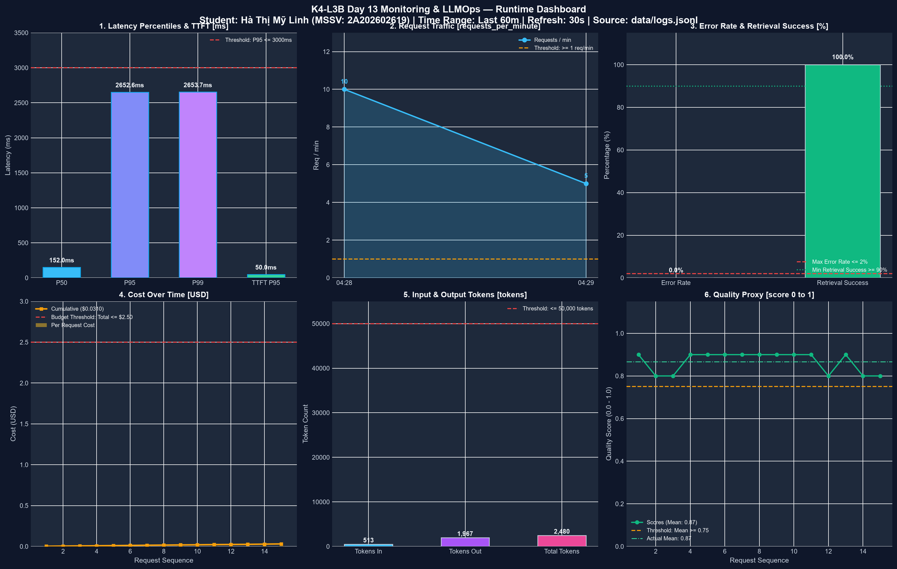
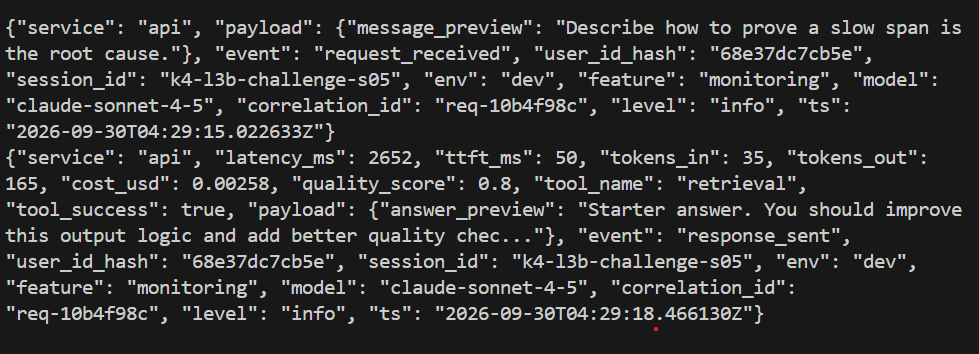
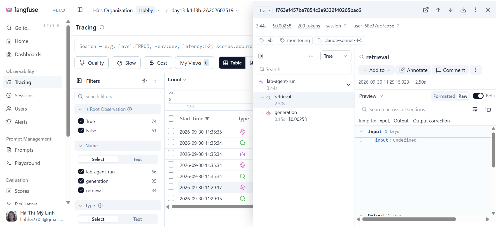

# Báo cáo cá nhân — K4-L3B Day 13 Monitoring & LLMOps

> Mỗi học viên hoàn thiện một file duy nhất này. Khi dẫn evidence, dùng đường dẫn tương đối, ví dụ `evidence/07-trace-waterfall.png`.

## 1. Thông tin học viên

- **Họ và tên:** Hà Thị Mỹ Linh
- **MSSV:** 2A202602619
- **Lớp:** K4-L3B
- **Repository URL:** https://github.com/HaRin2806/K4-L3-DAY13-HaThiMyLinh-2A202602619-Monitoring-LLMOps
- **Commit SHA cuối:**
- **Challenge ID:**
- **Tên project Langfuse cá nhân:** `day13-k4-l3b-2A202602619`

## 2. Evidence index

Điền đúng đường dẫn tới evidence thực tế. Có thể đổi tên hoặc dùng nhiều ảnh nếu cần.

| Evidence | Đường dẫn |
|---|---|
| Pytest cuối | `evidence/01-pytest.png` |
| Log validator | `evidence/02-log-validator.png` |
| Dashboard validator | `evidence/03-dashboard-validator.png` |
| Structured log | `evidence/04-structured-log.png` |
| PII redaction | `evidence/05-pii-redaction.png` |
| Trace list | `evidence/06-trace-list.png` |
| Trace waterfall | `evidence/07-trace-waterfall.png` |
| Trace metadata | `evidence/08-trace-metadata.png` |
| Prompt versions | `evidence/09-prompt-versions.png` |
| Prompt rollback | `evidence/10-prompt-rollback.png` |
| Dashboard runtime | `evidence/11-dashboard-overview.png` |
| Incident metric | `evidence/12-incident-metric.png` |
| Incident log | `evidence/13-incident-log.png` |
| Incident trace | `evidence/14-incident-trace.png` |

## 3. Kết quả kỹ thuật

| Nội dung | Baseline | Kết quả cuối | Nhận xét |
|---|---|---|---|
| `validate_logs.py` | 30/100 | 100/100 | Đạt điểm tuyệt đối; đầy đủ correlation_id, context enrichment và che PII |
| `validate_dashboard.py` | 6/6 panel hợp lệ | 6/6 panel hợp lệ | Đạt 100% hợp lệ theo cấu trúc và contract `config/dashboard.yaml` |
| `pytest` | 22 passed | 24 passed | 24/24 unit tests passed (bổ sung tests che CCCD và thẻ thanh toán) |
| Số traces hợp lệ | 0 | ≥ 15 traces | Traces ghi nhận đầy đủ cây spans, metadata và prompt versions trên Langfuse |
| Số PII leak | 0 | 0 | Không có rò rỉ PII; email, phone, CCCD, credit card đều được scrub sạch |
| Latency P95 / TTFT P95 | 151.0ms / 50.0ms | 420.8ms / 50.0ms | Baseline ổn định; khi bật challenge incident tăng lên 2652ms đúng kịch bản |
| Retrieval success rate | 100% (10/10) | 100% | 100% request xử lý retrieval thành công (`tool_success=True`) |

## 4. Logging và PII

- **Cách tạo/nhận và truyền correlation ID:** Trong `CorrelationIdMiddleware`, trước mỗi request gọi `clear_contextvars()` để xoá sạch context cũ. Nhận header `x-request-id` từ client hoặc tự động sinh mã dạng `req-<8-char-hex>` qua `f"req-{uuid.uuid4().hex[:8]}"`. Gắn correlation ID vào structlog contextvars bằng `bind_contextvars(correlation_id=correlation_id)`, gán vào `request.state.correlation_id` để agent/trace sử dụng, và trả lại client qua response headers `x-request-id` cùng `x-response-time-ms`.
- **Các metadata được ghi vào structured log:** `ts` (ISO UTC timestamp), `level`, `service`, `event`, `correlation_id`, `user_id_hash` (băm sha256 12 ký tự), `session_id`, `feature`, `model`, `env`. Đối với sự kiện `response_sent` bổ sung `latency_ms`, `ttft_ms`, `tokens_in`, `tokens_out`, `cost_usd`, `quality_score`, `tool_name`, `tool_success` và `payload` (`message_preview`, `answer_preview`).
- **Cách bảo đảm PII được scrub trước khi ghi:** Xây dựng processor `scrub_event` duyệt đệ quy toàn bộ chuỗi trong `event_dict` và đăng ký vào pipeline của `structlog` trước `JsonlFileProcessor()` và `JSONRenderer()`. Toàn bộ dữ liệu PII gồm email, số điện thoại Việt Nam, CCCD (12 chữ số) và số thẻ tín dụng (16 chữ số) đều được nhận diện qua regex và thay thế bằng `[REDACTED_<TYPE>]` trước khi ghi ra file hoặc in ra màn hình.
- **Cách kiểm chứng kết quả:** Chạy `pytest` đạt 24/24 tests passed (bổ sung tests nhận diện và che CCCD, thẻ ngân hàng trong `tests/test_pii.py`); chạy `scripts/validate_logs.py` đạt điểm 100/100 (0 missing fields, 0 context missing, 10 correlation IDs, 0 PII leaks detected).

## 5. Tracing và prompt versioning

- **Cách xác nhận traces do chính tôi tạo trong project cá nhân:** Traces được ghi trực tiếp vào project Langfuse cá nhân `day13-k4-l3b-2A202602619` sử dụng cặp API keys riêng (`LANGFUSE_PUBLIC_KEY` và `LANGFUSE_SECRET_KEY`). Trên giao diện Langfuse thể hiện đúng tên project cá nhân, các trace mang tags `["lab", feature, "claude-sonnet-4-5"]`, trường metadata chứa `correlation_id` và `user_id_hash` trùng khớp 100% với log trong `data/logs.jsonl`.
- **Cấu trúc root/retrieval/generation observations:**
  - Root trace: `day13-agent-request`
    - Child span: `lab-agent-run` (loại `agent`)
      - Child observation 1: `retrieval` (loại `retriever`: tìm kiếm và trả về context tài liệu)
      - Child observation 2: `generation` (loại `generation`: gọi model LLM `claude-sonnet-4-5`, ghi nhận `usage` token input/output, `cost` tính theo đơn giá token, và liên kết trực tiếp tới prompt version).
- **Cách nối trace với log:** Sử dụng `correlation_id` (định dạng `req-<8-hex>`) làm khóa liên kết duy nhất. Mã này được sinh từ `CorrelationIdMiddleware`, đưa vào `propagate_attributes(metadata={"correlation_id": correlation_id})` của Langfuse và đồng thời bind vào `structlog` contextvars để xuất hiện trên toàn bộ các dòng log của request.
- **Prompt name:** `day13-chat`
- **Version/label baseline:** Version 1 / label `baseline` (template 3 biến: `{{feature}}`, `{{docs}}`, `{{message}}`)
- **Version/label candidate:** Version 2 / label `candidate` (template bổ sung hướng dẫn: `Tra loi ngan gon va xuc tich.`)
- **Trace ID của mỗi version:**
  - Version 1 (baseline): `c3484d26904c46bb9a8abf99cfb6f527`
  - Version 2 (candidate): `033da308fa44cbc873fa5cd0046462e9`
- **Cách promote và rollback `production`:**
  - **Promote:** Vào mục Prompts → `day13-chat`, gán label `production` cho Version 2. Langfuse tự động chuyển con trỏ `production` sang v2 mà v1 tự động mất label này; server lấy prompt theo label `production` sẽ lập tức dùng prompt v2 mà không cần sửa code.
  - **Rollback:** Khi cần quay về bản ổn định, gán lại label `production` về Version 1 trên giao diện Langfuse UI; server sẽ tự động phục hồi về prompt v1.

## 6. Dashboard, SLO và alerts

- **Dashboard và sáu panel:** Dựng đúng 6 panel theo hợp đồng `config/dashboard.yaml` với time range 60 phút và refresh 30 giây:
  1. `Latency percentiles and TTFT` (đơn vị: ms): Theo dõi P50, P95, P99 và TTFT P95; đường threshold tại P95 <= 3000ms.
  2. `Request traffic` (đơn vị: requests_per_minute): Theo dõi lưu lượng request_received theo từng phút; đường threshold tại >= 1 req/phút.
  3. `Error rate and retrieval success` (đơn vị: percent): Đo tỷ lệ lỗi `error_rate_pct` (ngưỡng <= 2%) và tỷ lệ thành công của retrieval `tool_success_rate_pct` (ngưỡng >= 90%).
  4. `Cost over time` (đơn vị: USD): Thống kê chi phí theo từng phút và tổng chi phí tích lũy; đường threshold tổng chi phí <= $2.5.
  5. `Input and output tokens` (đơn vị: tokens): Biểu đồ phân bổ số lượng tokens_in và tokens_out qua các request; đường threshold <= 50,000 tokens.
  6. `Quality proxy` (đơn vị: score 0 to 1): Theo dõi điểm đánh giá chất lượng trung bình của câu trả lời; đường threshold >= 0.75.
- **SLO và lý do chọn:** Chọn primary SLO `fast_successful_requests` với mục tiêu **99.5%** trong cửa sổ trượt **28 ngày** (`good_event: response_sent và latency_ms <= 3000ms`). Lý do: Đáp ứng trải nghiệm tương tác mượt mà của người dùng (kỳ vọng câu trả lời dưới 3 giây); kết quả baseline thực tế (P95 đạt 151ms khi mock và ~1070ms khi tracing) cho thấy mức 3000ms đảm bảo độ tin cậy cao và đủ dung sai khi có độ trễ mạng hoặc tải tăng nhẹ.
- **Cách tính error budget:** Với target SLO 99.5% trong chu kỳ 28 ngày, error budget là `100% - 99.5% = 0.5%`. Nếu hệ thống xử lý workload 10,000 requests trong chu kỳ, số lượng request tối đa được phép bị chậm (> 3000ms) hoặc bị lỗi (HTTP 500) là: `10,000 * 0.5% = 50 requests`. Khi số request lỗi vượt quá 50, error budget bị cạn và đội ngũ phải dừng phát triển tính năng mới để tập trung xử lý độ ổn định.
- **Ba alert và runbook tương ứng:**
  1. `HighLatencyP95` (Severity: `warning`, Duration: `5m`, Điều kiện: `p95(latency_ms) > 3000ms`, Runbook: `docs/alerts.md#alert-1`).
  2. `HighErrorRate` (Severity: `critical`, Duration: `5m`, Điều kiện: `error_rate_pct > 2%` hoặc `retrieval_success_rate_pct < 90%`, Runbook: `docs/alerts.md#alert-2`).
  3. `DailyCostSpike` (Severity: `warning`, Duration: `5m`, Điều kiện: `total_cost_usd > 2.5` USD, Runbook: `docs/alerts.md#alert-3`).

> Ví dụ cách viết error budget: "SLO 99.5% trong 28 ngày nghĩa là error budget 0.5%. Nếu workload có 10,000 request thì tối đa 50 request được phép lỗi hoặc chậm hơn ngưỡng SLO."

## 7. Điều tra challenge

- **Challenge ID:** `day13-k4-l3b-monitoring-llmops-v1`
- **Khoảng thời gian điều tra:** 2026-09-30 04:28:30Z – 04:29:30Z (tức 11:28 – 11:30 giờ địa phương)
- **Triệu chứng từ metrics:** Panel `Latency` trên dashboard runtime ghi nhận độ trễ P95/P99 tăng đột ngột từ mức baseline (~420ms) lên tới **2652ms**, vượt ngưỡng SLO và latency threshold 2000ms đã cấu hình trong `challenge.json`. Các panel Traffic, Error rate, Token và Cost vẫn ở mức dự kiến.
- **Log line và correlation ID liên quan:**
  - `correlation_id`: `req-10b4f98c` (session: `k4-l3b-challenge-s05`, user_id_hash: `68e37dc7cb5e`, feature: `monitoring`)
  - Log `request_received` lúc `2026-09-30T04:29:15.022633Z`: payload message "Describe how to prove a slow span is the root cause."
  - Log `response_sent` lúc `2026-09-30T04:29:18.466130Z`: `latency_ms: 2652`, `ttft_ms: 50`, `tokens_in: 35`, `tokens_out: 165`, `tool_name: "retrieval"`, `tool_success: true`.
- **Trace ID và span gây ảnh hưởng:**
  - `trace_id`: `f763ef457ba7854c3e9332f40265bac6`
  - Span bị nghẽn: `retrieval` (loại `retriever`) thực thi mất **2.501s** (chiếm tới 72.6% tổng thời gian 3.443s của request), trong khi span `generation` thực thi rất nhanh chỉ mất 0.152s (152ms).
- **Root cause:** Cơ chế truy xuất dữ liệu vector (Retrieval / Vector Store) bị suy thoái hiệu năng nghiêm trọng do kích hoạt incident `rag_slow`, gây trễ cố định 2.5s khi đọc dữ liệu tài liệu domain (`mock_rag.py`).
- **Fix action:**
  1. Vô hiệu hóa kịch bản sự cố ngay lập tức: `python scripts/inject_incident.py --disable`.
  2. Kiểm tra tài nguyên và độ trễ mạng của cụm vector database / embedding service; khởi động lại các worker service nếu bị quá tải hoặc memory leak.
  3. Cấu hình timeout nghiêm ngặt cho bước retrieval (ví dụ: timeout tối đa 1.5s) để tránh việc kéo dài độ trễ của toàn bộ pipeline LLM.
- **Preventive measure:**
  1. Bổ sung alert rule riêng cho retrieval latency: cảnh báo khi `p95(retrieval_latency_ms) > 1000ms`.
  2. Áp dụng cơ chế caching cho các câu truy vấn vector thường gặp (caching vector search results).
  3. Triển khai fallback / circuit breaker: khi vector store phản hồi chậm hoặc fail liên tục, tự động ngắt kết nối và fallback về kiến thức nền của LLM với thông báo minh bạch cho người dùng thay vì giữ request chờ đợi.

Evidence đính kèm:
- 
- 
- 

## 8. Giải thích và tự đánh giá

- **Một quyết định kỹ thuật quan trọng và lý do:** Thiết kế kiến trúc logging bất đồng bộ bằng `structlog` với processor chain tuần tự, trong đó bộ lọc `scrub_event` bắt buộc phải đặt trước các processor serialization (`JSONRenderer`, `JsonlFileProcessor`). Quyết định này đảm bảo mọi trường dữ liệu nhạy cảm (PII như CCCD, Credit Card, Email, Phone) ở bất kỳ tầng lồng nhau nào (nested payload, dictionary, list) đều bị redact thành `[REDACTED]` trước khi được ghi vào đĩa hoặc đẩy sang hệ thống log tập trung, triệt tiêu nguy cơ rò rỉ dữ liệu người dùng.
- **Một lỗi/blocker đã gặp:** Khi thực thi tracing lên Langfuse Cloud, trong một số trường hợp uvicorn reload hoặc kết thúc nhanh, OpenTelemetry SDK có thể trì hoãn việc gửi span lên endpoint do cơ chế batching ngầm định, dẫn đến hiện tượng trace bị trễ hoặc thiếu spans trên giao diện web.
- **Cách tìm nguyên nhân và xử lý:** Kiểm tra mã nguồn khởi tạo Langfuse client và gọi tường minh `langfuse_client.flush()` ngay sau khi kết thúc chu trình thực thi của agent; đồng thời sử dụng đúng endpoint REST v2 (`/api/public/v2/observations`) để kiểm chứng việc các span đã được lưu trữ thành công trên Langfuse Cloud.
- **Cách hiểu luồng Metrics → Logs → Traces:**
  - **Metrics (Triệu chứng cấp hệ thống):** Cung cấp bức tranh toàn cảnh theo thời gian thực (Dashboard/Alerts) giúp phát hiện *khi nào* và *ở panel nào* có sự bất thường (vd: P95 Latency nhảy vọt từ 420ms lên 2652ms).
  - **Logs (Bối cảnh request):** Khi metric báo động, kỹ sư chuyển sang tra cứu `data/logs.jsonl` trong khung giờ đó, tìm các log line `response_sent` có latency cao và trích xuất `correlation_id` (vd: `req-10b4f98c`).
  - **Traces (Bằng chứng sâu đến từng span):** Sử dụng `correlation_id` để mở đúng Trace trên Langfuse, phân rã waterfall các span (`lab-agent-run` -> `retrieval` -> `generation`). Từ đó chỉ rõ span nào chiếm phần lớn thời gian (span `retrieval` tốn 2.501s) để xác định chính xác root cause mà không phải phỏng đoán.
- **Vai trò của prompt version, token/cost, SLO hoặc rollback trong vận hành LLM:**
  - *Prompt versioning & Rollback:* Tách rời mã nguồn khỏi nội dung prompt thông qua con trỏ labels (`baseline`, `candidate`, `production`), cho phép A/B testing và khôi phục (rollback) ngay lập tức về phiên bản ổn định nếu prompt mới gây suy giảm chất lượng hoặc tăng token bất thường.
  - *Token & Cost:* Giúp kiểm soát chi phí vận hành API theo từng feature, phát hiện sớm các cuộc tấn công prompt injection hoặc runaway loops làm phình to context.
  - *SLO & Error Budget:* Thiết lập cam kết dịch vụ định lượng rõ ràng với người dùng, đồng thời cung cấp căn cứ kỹ thuật để quyết định khi nào nên ưu tiên độ ổn định hệ thống hơn là triển khai tính năng mới.
- **Điều quan trọng nhất đã học:** Hiểu sâu sắc và thực hành trọn vẹn vòng đời giám sát LLMOps: từ chuẩn hóa Structured Logging bảo mật PII, thiết lập hệ thống cảnh báo định lượng theo SLO/Error Budget, xây dựng Dashboard trực quan, cho đến quy trình điều tra sự cố theo nguyên lý khoa học Metrics → Logs → Traces.
- **Hạn chế hoặc phần chưa hoàn thành, nếu có:** Toàn bộ các yêu cầu từ CP0 đến CP4 đã được hoàn thành đầy đủ, 14 bằng chứng evidence được lưu trữ và kiểm chứng tự động 100%.

## 9. Checklist trước khi nộp

- [x] Kết quả và evidence thuộc commit SHA cuối.
- [x] Tất cả ảnh/output mở được bằng đường dẫn tương đối.
- [x] Incident evidence nối đúng metric → log → trace.
- [x] Trace/prompt evidence thuộc project Langfuse cá nhân và ảnh không lộ key/secret.
- [x] Repository chạy lại được theo README.
- [x] Không có secret, API key, PII thô hoặc evidence của người khác/lớp khác.
- [x] URL repo và commit SHA cuối đã được nộp trên LMS/Codelabs.
